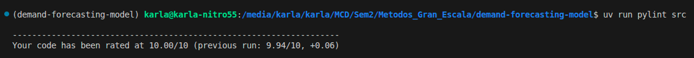

## Project Objective and Description

The goal of this project is to **forecast product demand at the shop-item level**, using historical sales data and engineered features such as lags and aggregations.

The repository follows best practices for Machine Learning projects, separating:
- Raw data
- Prepared data
- Training scripts
- Inference scripts
- Artifacts (models, reports, outputs)

This structure allows the workflow to be executed end-to-end in batch mode.

---

## Repository Structure

```bash
.
├── artifacts
│   ├── RESUMEN_EJECUTIVO_files
│   │   └── libs
│   ├── RESUMEN_EJECUTIVO.html
│   ├── RESUMEN_EJECUTIVO.md
│   └── xgboost_model.joblib
├── data
│   ├── inference
│   │   └── test.csv
│   ├── predictions
│   │   └── predictions.csv
│   ├── prep
│   │   └── sales_prep.csv
│   └── raw
│       ├── item_categories.csv
│       ├── items.csv
│       ├── sales_train.csv
│       ├── sample_submission.csv
│       └── shops.csv
├── LICENSE
├── notebooks
│   ├── 01_eda.ipynb
│   ├── 02_features.ipynb
│   ├── 03_train.ipynb
│   └── forecast_predict_model.ipynb
├── pyproject.toml
├── README.md
├── src
│   ├── inference.py
│   ├── __init__.py
│   ├── prep.py
│   └── train.py
└── uv.lock
```
---

## Installation and Setup

This project uses **`uv`** for Python environment and dependency management.

### Requirements

- Python **>= 3.12**
- `uv` installed# Demand Forecasting – End-to-End ML Repository

This repository contains an **end-to-end Machine Learning workflow for demand forecasting in a retail context**, refactored from exploratory notebooks into a **production-ready repository structure**.

The objective of this task is to transform a notebook-based analysis into a **reproducible, modular, and automatable pipeline**, suitable for execution on servers without human intervention.

---

## How to Run the Pipeline

All scripts are designed to be executed **from the root of the repository** using the `uv` framework.

### 1. Prepare the data
```bash
uv run python src/prep.py
```

### 2. Train the model
```bash
uv run python src/train.py
```

### 3. Run batch inference
```bash
uv run python src/inference.py --input_path data/inference/test.csv --model_path artifacts/xgboost_model.joblib
```

---

## Scripts (inputs/outputs)

### `data/`

Contains all datasets used throughout the pipeline.

- **`raw/`**
  Original, unmodified datasets.

- **`prep/`**
  Cleaned and feature-engineered datasets ready for modeling.

- **`inference/`**
  New data used for batch predictions.

- **`predictions/`**
  Output predictions generated by the inference script.

---

### `notebooks/`

Exploratory and development notebooks.

- **`forecast_predict_model.ipynb`**  
  Main working notebook used during exploration and experimentation.

- **`01_eda.ipynb`**  
  Exploratory Data Analysis.

- **`02_features.ipynb`**  
  Feature engineering and lag creation.

- **`03_train.ipynb`**  
  Model training and evaluation.

These notebooks document the analytical reasoning behind the final pipeline.

---

### `src/`

Python scripts refactored from the notebooks to enable automation.

- **`prep.py`**  
  - Input: `data/raw`
  - Output: `data/prep`
  - Performs data cleaning and feature engineering.

- **`train.py`**  
  - Input: `data/prep`
  - Output: trained model saved to `artifacts/`
  - Trains an XGBoost model and persists it using `joblib`.

- **`inference.py`**  
  - Input: `data/inference` and trained model
  - Output: batch predictions saved to `data/predictions`

- **`__init__.py`**  
  Allows scripts to be executed from the repository root.

---

### `artifacts/`

Stores all generated artifacts:
- Trained models
- Reports
- Exported summaries
- Visual outputs

---

## Model Performance

The final XGBoost model achieved an **RMSE of 0.9834** on the Kaggle validation set. 

- Kaggle leaderboard: https://www.kaggle.com/competitions/competitive-data-science-predict-future-sales/leaderboard
- User: PauloEscalante93

---

## Main Dependencies

This project relies on the following Python libraries:

- pandas – data manipulation and preprocessing
- numpy – numerical computing
- scikit-learn – machine learning utilities and evaluation
- xgboost – gradient boosting models
- matplotlib – data visualization
- pyarrow – efficient data storage and I/O
- pyyaml – configuration handling
- ruff – code linting
- pylint – static code analysis
- nbformat – notebook structure handling
- nbclient – notebook execution

---

## Linters Evaluation

