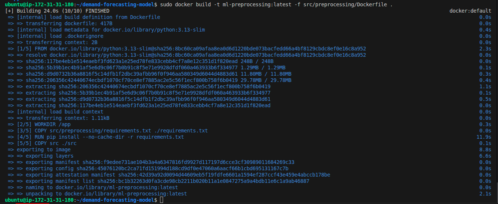
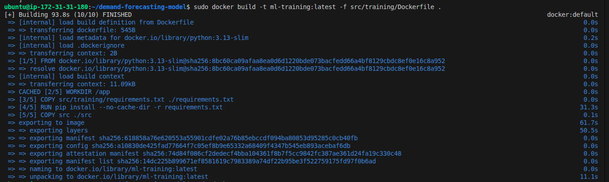
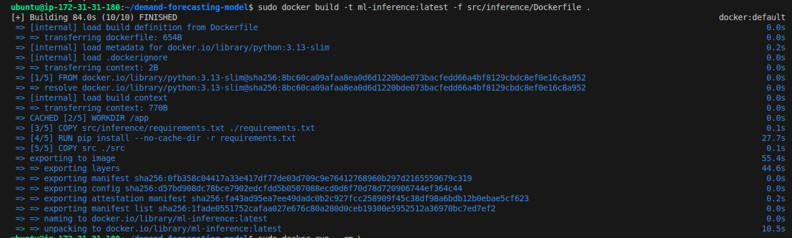
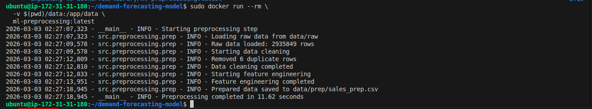
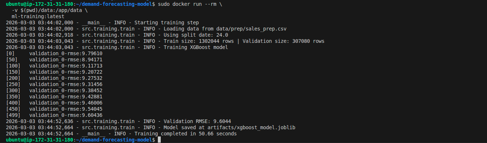
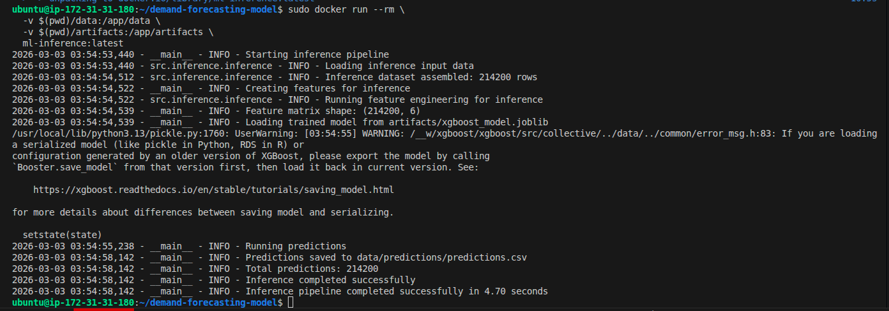

# Demand Forecasting – End-to-End ML Repository

This repository contains an **end-to-end Machine Learning workflow for demand forecasting in a retail context**, refactored from exploratory notebooks into a **production-ready repository structure**.

The objective of this task is to transform a notebook-based analysis into a **reproducible, modular, and automatable pipeline**, suitable for execution on servers without human intervention.

The project includes:
- Modular ML pipeline
- Batch preprocessing, training, and inference
- Dockerized execution for reproducibility
- Structured Git workflow
- Automated testing and linting

## Project Objective and Description

The goal of this project is to **forecast product demand at the shop-item level**, using historical sales data and engineered features such as lags and aggregations.

The repository follows best practices for Machine Learning projects, separating:
- Raw data
- Prepared data
- Training scripts
- Inference scripts
- Artifacts (models, reports, outputs)

This structure allows the workflow to be executed end-to-end in batch mode.

## Repository Structure

```bash
.
├── artifacts
│   ├── RESUMEN_EJECUTIVO_files
│   │   └── libs
│   ├── RESUMEN_EJECUTIVO.html
│   ├── RESUMEN_EJECUTIVO.md
│   └── xgboost_model.joblib
├── data
│   ├── inference
│   │   └── test.csv
│   ├── predictions
│   │   └── predictions.csv
│   ├── prep
│   │   └── sales_prep.csv
│   └── raw
│       ├── item_categories.csv
│       ├── items.csv
│       ├── sales_train.csv
│       ├── sample_submission.csv
│       └── shops.csv
├── docs
│   └── images
├── LICENSE
├── notebooks
│   ├── 01_eda.ipynb
│   ├── 02_features.ipynb
│   ├── 03_train.ipynb
│   └── forecast_predict_model.ipynb
├── pyproject.toml
├── README.md
├── src
│   ├── inference
│   │   ├── Dockerfile
│   │   ├── inference.py
│   │   ├── __main__.py
│   │   ├── requirements.txt
│   │   └── test_inference.py
│   ├── __init__.py
│   ├── preprocessing
│   │   ├── Dockerfile
│   │   ├── __main__.py
│   │   ├── prep.py
│   │   ├── requirements.txt
│   │   └── test
│   │       └── test_prep.py
│   └── training
│       ├── Dockerfile
│       ├── __main__.py
│       ├── requirements.txt
│       ├── test
│       │   └── test_train.py
│       └── train.py
└── uv.lock
```
---

## Installation and Setup

This project uses **`uv`** for Python environment and dependency management.

### Requirements

- Python **>= 3.12**
- `uv` installed
- Docker (optional, for containerized execution)

## How to Run the Pipeline

All the modules are designed to be executed **from the root of the repository** using the `uv` framework.

### 1. Prepare the data
```bash
uv run python -m src.preprocessing --raw-path data/raw --output-path data/prep
```

### 2. Train the model
```bash
uv run python -m src.training
```

### 3. Run batch inference
```bash
uv run python -m src.inference --input_path data/inference/test.csv --model_path artifacts/xgboost_model.joblib
```

## Running the Pipeline with Docker
---

Each stage of the pipeline is containerized:
- preprocessing
- training
- inference
This ensures **reproducibility and environment isolation**.

### 1. Build Docker Images

Run from the **repository root**.

- Preprocessing image:

```bash
docker build -t ml-preprocessing:latest -f src/preprocessing/Dockerfile .
```

- Training image:

```bash
docker build -t ml-training:latest -f src/training/Dockerfile .
```

- Inference image
```bash
docker build -t ml-inference:latest -f src/inference/Dockerfile .
```

### 2. Run Pipeline with Docker

Docker containers access project files using **mounted volumes**.

1. Preprocessing

```bash
docker run --rm \
  -v $(pwd)/data:/app/data \
  ml-preprocessing:latest
```

2. Training
```bash
docker run --rm \
  -v $(pwd)/data:/app/data \
  ml-training:latest
```

3. Inference
```bash
docker run --rm \
  -v $(pwd)/data:/app/data \
  -v $(pwd)/artifacts:/app/artifacts \
  ml-inference:latest \
  --input_path data/otro_test.csv \
  --month 12
```

## Scripts (inputs/outputs)

### `data/`

Contains all datasets used throughout the pipeline.

- **`raw/`**
  Original, unmodified datasets.

- **`prep/`**
  Cleaned and feature-engineered datasets ready for modeling.

- **`inference/`**
  New data used for batch predictions.

- **`predictions/`**
  Output predictions generated by the inference script.

---

### `notebooks/`

Exploratory and development notebooks.

- **`forecast_predict_model.ipynb`**  
  Main working notebook used during exploration and experimentation.

- **`01_eda.ipynb`**  
  Exploratory Data Analysis.

- **`02_features.ipynb`**  
  Feature engineering and lag creation.

- **`03_train.ipynb`**  
  Model training and evaluation.

These notebooks document the analytical reasoning behind the final pipeline.

---

### `src/`

Python scripts refactored from the notebooks to enable automation.

- **`prep.py`**  
  - Input: `data/raw`
  - Output: `data/prep`
  - Performs data cleaning and feature engineering.

- **`train.py`**  
  - Input: `data/prep`
  - Output: trained model saved to `artifacts/`
  - Trains an XGBoost model and persists it using `joblib`.

- **`inference.py`**  
  - Input: `data/inference` and trained model
  - Output: batch predictions saved to `data/predictions`

- **`__init__.py`**  
  Allows scripts to be executed from the repository root.

---

### `artifacts/`

Stores all generated artifacts:
- Trained models
- Reports
- Exported summaries
- Visual outputs

---

## Git Workflow

We follow a structured Git workflow to ensure traceability, code quality, and collaborative development.

### Branch Structure

`main`
Stable production branch. Only reviewed and validated code is merged here.

`development`
Integration branch where completed features are merged after review. This is the base branch for new work.

**Feature Branches**
All changes are developed in separate branches created from `development`.

### Branch Naming Convention

Branches follow a prefix-based convention to clearly indicate the type of change:

- `feature/<short-description>` → New functionality
- `refactor/<short-description>` → Code improvements without changing behavior
- `bug/<short-description>` → Non-critical bug fixes
- `hotfix/<short-description>` → Critical production fixes

Examples:

```bash
feature/add-inference-logging
refactor/clean-training-pipeline
bug/fix-null-handling
hotfix/model-loading-error
```

### Commit Message Convention

Commits follow the same prefix structure as branch names to enable easy filtering and automated parsing.

Format:

type: short descriptive message

Examples:
```bash
feature: add month argument to inference pipeline
refactor: simplify preprocessing logic
bug: fix incorrect date parsing
hotfix: resolve model path issue
```

This convention helps extract structured information from commit history and improves readability.

### Development Process

1. Create a branch from development.
2. Implement changes and commit following the commit convention.
3. Push the branch to the remote repository.
4. Open a Pull Request (PR) targeting development.
5. Team members review and test the changes.
6. Once approved, the branch is merged into development.
7. After a development cycle is complete and all changes are validated, development is merged into main.
8. The cycle then restarts from development.

This workflow ensures isolated development, structured collaboration, controlled releases, and a clean production branch.


## Model Performance

The final XGBoost model achieved an **RMSE of 0.9834** on the Kaggle validation set. 

- Kaggle leaderboard: https://www.kaggle.com/competitions/competitive-data-science-predict-future-sales/leaderboard
- User: PauloEscalante93

---

## Main Dependencies

This project relies on the following Python libraries:

- pandas – data manipulation and preprocessing
- numpy – numerical computing
- scikit-learn – machine learning utilities and evaluation
- xgboost – gradient boosting models
- matplotlib – data visualization
- pyarrow – efficient data storage and I/O
- pyyaml – configuration handling
- ruff – code linting
- pylint – static code analysis
- nbformat – notebook structure handling
- nbclient – notebook execution

---

## Screenshots

### Linters Evaluation


### Build




### Run



