# Demand Forecasting – End-to-End ML Repository

This repository contains an **end-to-end Machine Learning workflow for demand forecasting in a retail context**, refactored from exploratory notebooks into a **production-ready repository structure**.

The objective of this project is to transform a notebook-based analysis into a **reproducible, modular, and automatable ML system**, capable of running both locally and in the cloud without manual intervention.

The project includes:
- A modular **ML pipeline** covering preprocessing, training, evaluation, and inference
- Batch **data preprocessing, model training, and inference workflows**
- Dockerized execution for full reproducibility (**BYOC – Bring Your Own Container**)
- Structured Git workflow for collaborative development
- Automated testing and linting
- Custom containers for **training, preprocessing, evaluation, and inference**
- Integration with **Amazon SageMaker** for scalable processing and model training
- A custom **SageMaker Processing Job (BYOC)** for data transformation using `pandas` and `scikit-learn`
- An end-to-end **SageMaker Pipeline** orchestrating the full ML lifecycle:
  - Preprocessing
  - Training
  - Evaluation (RMSE-based)
  - Conditional model validation
  - Model registration in SageMaker Model Registry
  - Batch inference (Transform step)
- Deployment capabilities for both **batch inference and real-time endpoints**
- A complete workflow from **local development to cloud-based production execution**

## Project Objective and Description

The goal of this project is to **forecast product demand at the shop-item level**, using historical sales data and engineered features such as aggregations and temporal transformations.

The repository follows best practices for Machine Learning projects, separating:
- Raw data
- Prepared data
- Preprocessing logic
- Training scripts
- Evaluation logic
- Inference scripts
- Artifacts (models, reports, outputs)

This structure enables a fully reproducible **end-to-end batch workflow**, from raw data ingestion to model predictions.

In addition, the project includes a **cloud-based ML workflow using Amazon SageMaker**, enabling scalable data processing, model training, evaluation, and inference through custom Docker containers (BYOC). Data preprocessing is implemented as a **SageMaker Processing Job**, ensuring that raw data can be transformed into training-ready features in a reproducible and scalable manner.

Building on this, the project implements a complete **SageMaker Pipeline (BYOC)** that orchestrates the full ML lifecycle:

- Automated preprocessing and feature engineering
- Model training using custom containers
- Model evaluation using RMSE as the primary metric
- Conditional validation based on a configurable performance threshold
- Model registration in the **SageMaker Model Registry**
- Batch inference using SageMaker **Batch Transform**

Additionally, the model can be deployed to a **real-time endpoint** for on-demand predictions, providing both batch and online inference capabilities within the same architecture.

This design ensures that the workflow is not only modular and reproducible, but also **production-ready and scalable in a cloud environment**.

The repository therefore supports:

- **Local batch execution** using the modular pipeline for preprocessing, training, evaluation, and inference
- **Cloud-based execution on Amazon SageMaker**, including:
  - Scalable preprocessing via Processing Jobs (BYOC)
  - Model training with custom containers
  - Model evaluation with automated metric tracking (RMSE)
  - Orchestration through a full **SageMaker Pipeline**
  - Conditional model validation and registration in the Model Registry
  - Batch inference using **SageMaker Batch Transform**
  - Optional deployment to **real-time endpoints** for online predictions

## Repository Structure

```bash
.
├── artifacts
│   ├── RESUMEN_EJECUTIVO_files
│   │   └── libs
│   ├── RESUMEN_EJECUTIVO.html
│   ├── RESUMEN_EJECUTIVO.md
│   └── xgboost_model.joblib
├── data
│   ├── inference
│   │   └── test.csv
│   ├── predictions
│   │   └── predictions.csv
│   ├── prep
│   │   └── sales_prep.csv
│   └── raw
│       ├── item_categories.csv
│       ├── items.csv
│       ├── sales_train.csv
│       ├── sample_submission.csv
│       └── shops.csv
├── docs
│   └── images
├── LICENSE
├── notebooks
│   ├── 01_eda.ipynb
│   ├── 02_features.ipynb
│   ├── 03_train.ipynb
│   └── forecast_predict_model.ipynb
├── processing
│   ├── README.md
│   ├── sm_processing_byoc.ipynb
│   ├── code
│   │   ├── preprocess.py
│   ├── container
│   │   ├── Dockerfile
├── pipeline
│   ├── README.md
│   ├── Pipeline_notebook_byoc.ipynb
│   ├── sagemaker_pipeline_byoc.ipynb
├── sagemaker
│   ├── README.md
│   ├── dem-fore-model.ipynb
├── pyproject.toml
├── README.md
├── src
│   ├── inference
│   │   ├── Dockerfile
│   │   ├── inference.py
│   │   ├── __main__.py
│   │   ├── requirements.txt
│   │   └── test_inference.py
│   │   └── serve.py
│   ├── __init__.py
│   ├── preprocessing
│   │   ├── Dockerfile
│   │   ├── __main__.py
│   │   ├── prep.py
│   │   ├── requirements.txt
│   │   └── test
│   │       └── test_prep.py
│   └── training
│       ├── Dockerfile
│       ├── __main__.py
│       ├── requirements.txt
│       ├── test
│       │   └── test_train.py
│       └── train.py
└── uv.lock
```
---

## Installation and Setup

This project uses **`uv`** for Python environment and dependency management.

### Requirements

- Python **>= 3.12**
- `uv` installed
- Docker (required for containerized execution and SageMaker BYOC workflows)
- AWS CLI configured (for interaction with Amazon S3, ECR, and SageMaker)
- Access to **Amazon SageMaker Studio** (recommended for running processing, training, and pipeline jobs)
- An AWS account with permissions for:
  - Amazon S3 (data storage)
  - Amazon ECR (container registry)
  - Amazon SageMaker (processing, training, pipelines, and model registry)

These requirements enable both local execution and full cloud deployment, including the orchestration of the end-to-end ML workflow through **SageMaker Pipelines (BYOC)**.

## How to Run the Pipeline

All the modules are designed to be executed **from the root of the repository** using the `uv` framework.

### 1. Prepare the data
```bash
uv run python -m src.preprocessing --raw-path data/raw --output-path data/prep
```

### 2. Train the model
```bash
uv run python -m src.training
```

### 3. Run batch inference
```bash
uv run python -m src.inference --input_path data/inference/test.csv --model_path artifacts/xgboost_model.joblib
```

### 4. Run preprocessing as a SageMaker Processing Job (BYOC)

The preprocessing step can be executed in a scalable and reproducible way using a custom container (BYOC) in SageMaker. The full workflow — including Docker build, ECR push, data upload to S3, Processing Job execution, and output validation — is implemented in:
```bash
processing/sm_processing_byoc.ipynb
```

### 5. Deploy and test the model on Amazon SageMaker

The full deployment process — including **container build, ECR upload, SageMaker training job execution, endpoint deployment, and endpoint invocation** — is documented in the following notebook:
```bash
sagemaker/dem-fore-model.ipynb
```

### 6. Run the complete ML pipeline

A fully automated pipeline is implemented using SageMaker Pipelines, orchestrating all steps of the ML lifecycle with custom containers (BYOC):

- Preprocessing
- Training
- Evaluation (RMSE-based)
- Conditional model validation
- Model registration in Model Registry
- Batch inference (Transform step)

The pipeline can be executed from:
```bash
pipeline/Pipeline_notebook_byoc.ipynb
```
This notebook:

- Builds and connects all pipeline steps
- Executes the pipeline
- Tracks execution status
- Produces all artifacts in S3
- Registers the model in SageMaker Model Registry

---

## Running the Pipeline with Docker

Each stage of the pipeline is containerized:
- preprocessing (local module and SageMaker Processing BYOC)
- training
- inference

This ensures **reproducibility and environment isolation**, allowing the same code to run consistently across local and cloud environments. The preprocessing stage can be executed either locally via the modular pipeline or at scale using a custom Docker container within **Amazon SageMaker Processing**.

### 1. Build Docker Images

Run from the **repository root**.

- Preprocessing image:

```bash
docker build -t ml-preprocessing:latest -f src/preprocessing/Dockerfile .
```

- Training image:

```bash
docker build -t ml-training:latest -f src/training/Dockerfile .
```

- Inference image
```bash
docker build -t ml-inference:latest -f src/inference/Dockerfile .
```

### 2. Run Pipeline with Docker

Docker containers access project files using **mounted volumes**.

1. Preprocessing

```bash
docker run --rm \
  -v $(pwd)/data:/app/data \
  ml-preprocessing:latest
```

2. Training
```bash
docker run --rm \
  -v $(pwd)/data:/app/data \
  ml-training:latest
```

3. Inference
```bash
docker run --rm \
  -v $(pwd)/data:/app/data \
  -v $(pwd)/artifacts:/app/artifacts \
  ml-inference:latest \
  --input_path data/otro_test.csv \
  --month 12
```

### 3. Docker Containers for SageMaker (BYOC)

In addition to local Docker execution, the project uses custom Docker containers for Amazon SageMaker across all stages of the ML lifecycle:

- Data preprocessing **(SageMaker Processing BYOC)**
- Model training (custom training container)
- Model evaluation (custom processing container)
- Batch inference and real-time serving (custom inference container)

These images are pushed to Amazon Elastic Container Registry (ECR) and used by SageMaker to:

- Run scalable data preprocessing jobs via **SageMaker Processing**
- Execute training jobs using custom containers
- Evaluate models and generate metrics (RMSE)
- Run batch inference via SageMaker Batch Transform
- Deploy models to real-time endpoints

The complete pipeline workflow is implemented in:
```bash
pipeline/Pipeline_notebook_byoc.ipynb
```
Additional workflows:
```bash
processing/sm_processing_byoc.ipynb
```

```bash
sagemaker/dem-fore-model.ipynb
```

This design ensures that the same containerized logic is reused consistently across local execution and cloud-based orchestration.
---

## Scripts (inputs/outputs)

### `data/`

Contains all datasets used throughout the pipeline.

- **`raw/`**
  Original, unmodified datasets.

- **`prep/`**
  Cleaned and feature-engineered datasets ready for modeling.

- **`inference/`**
  New data used for batch predictions.

- **`predictions/`**
  Output predictions generated by the inference script.

---

### `notebooks/`

Exploratory and development notebooks.

- **`forecast_predict_model.ipynb`**  
  Main working notebook used during exploration and experimentation.

- **`01_eda.ipynb`**  
  Exploratory Data Analysis.

- **`02_features.ipynb`**  
  Feature engineering and lag creation.

- **`03_train.ipynb`**  
  Model training and evaluation.

These notebooks document the analytical reasoning behind the final pipeline.

---

### `processing/`

Data preprocessing pipeline using **SageMaker Processing (BYOC)**

- **`sm_processing_byoc.ipynb`**  
  Demonstrates the full workflow of building a custom Docker container, pushing the image to Amazon ECR, uploading raw data to S3, executing a SageMaker Processing Job, and validating the transformed output.

- **`code/preprocess.py`**  
  Contains the preprocessing logic, including data loading, cleaning, merging datasets, and feature engineering to generate a training-ready dataset.

- **`container/Dockerfile`**  
  Defines the custom Docker image used in the Processing Job, including all required dependencies (`pandas`, `numpy`, `scikit-learn`).

- **`README.md`**  
  Documents the preprocessing workflow, architecture, and usage of the BYOC Processing Job.

---

### `pipeline/`

End-to-end ML orchestration using **SageMaker Pipelines (BYOC)**

- **`Pipeline_notebook_byoc.ipynb`**  
  Main notebook that defines and executes the full SageMaker Pipeline, including preprocessing, training, evaluation (RMSE-based), conditional validation, model registration, and batch inference.

- **`sagemaker_pipeline_byoc.ipynb`**  
  Supporting notebook used for setting up container images, managing ECR integration, and preparing the environment required to run the pipeline in SageMaker.

- **`README.md`**  
  Provides an overview of the pipeline architecture, workflow, and instructions for executing the end-to-end pipeline using custom containers.

---

### `sagemaker/`

Deploy and test the model on Amazon SageMaker

- **`dem-fore-model.ipynb`**  
  Demonstrates the full process of building containers, pushing images to ECR, launching a SageMaker training job, and deploying the model to a real-time endpoint.

---

### `src/`

Python scripts refactored from the notebooks to enable automation.

- **`prep.py`**  
  - Input: `data/raw`
  - Output: `data/prep`
  - Performs data cleaning and feature engineering.

- **`train.py`**  
  - Input: `data/prep`
  - Output: trained model saved to `artifacts/`
  - Trains an XGBoost model and persists it using `joblib`.

- **`inference.py`**  
  - Input: `data/inference` and trained model
  - Output: batch predictions saved to `data/predictions`

- **`__init__.py`**  
  Allows scripts to be executed from the repository root.

---

### `artifacts/`

Stores all generated artifacts:
- Trained models
- Reports
- Exported summaries
- Visual outputs

---

## Git Workflow

We follow a structured Git workflow to ensure traceability, code quality, and collaborative development.

### Branch Structure

`main`
Stable production branch. Only reviewed and validated code is merged here.

`development`
Integration branch where completed features are merged after review. This is the base branch for new work.

**Feature Branches**
All changes are developed in separate branches created from `development`.

### Branch Naming Convention

Branches follow a prefix-based convention to clearly indicate the type of change:

- `feature/<short-description>` → New functionality
- `refactor/<short-description>` → Code improvements without changing behavior
- `bug/<short-description>` → Non-critical bug fixes
- `hotfix/<short-description>` → Critical production fixes

Examples:

```bash
feature/add-inference-logging
refactor/clean-training-pipeline
bug/fix-null-handling
hotfix/model-loading-error
```

### Commit Message Convention

Commits follow the same prefix structure as branch names to enable easy filtering and automated parsing.

Format:

type: short descriptive message

Examples:
```bash
feature: add month argument to inference pipeline
refactor: simplify preprocessing logic
bug: fix incorrect date parsing
hotfix: resolve model path issue
```

This convention helps extract structured information from commit history and improves readability.

### Development Process

1. Create a branch from development.
2. Implement changes and commit following the commit convention.
3. Push the branch to the remote repository.
4. Open a Pull Request (PR) targeting development.
5. Team members review and test the changes.
6. Once approved, the branch is merged into development.
7. After a development cycle is complete and all changes are validated, development is merged into main.
8. The cycle then restarts from development.

This workflow ensures isolated development, structured collaboration, controlled releases, and a clean production branch.


## Model Performance

The final XGBoost model achieved an **RMSE of 0.9834** on the Kaggle validation set. 

- Kaggle leaderboard: https://www.kaggle.com/competitions/competitive-data-science-predict-future-sales/leaderboard
- User: PauloEscalante93

---

## Main Dependencies

This project relies on the following Python libraries:

- pandas – data manipulation and preprocessing
- numpy – numerical computing
- scikit-learn – machine learning utilities and evaluation
- xgboost – gradient boosting models
- matplotlib – data visualization
- pyarrow – efficient data storage and I/O
- pyyaml – configuration handling
- boto3 – interaction with AWS services (S3, ECR, SageMaker)
- sagemaker – orchestration of training and processing jobs on Amazon SageMaker
- ruff – code linting
- pylint – static code analysis
- nbformat – notebook structure handling
- nbclient – notebook execution

---

## Screenshots

### Linters Evaluation
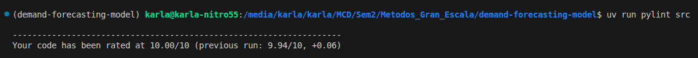

### Build
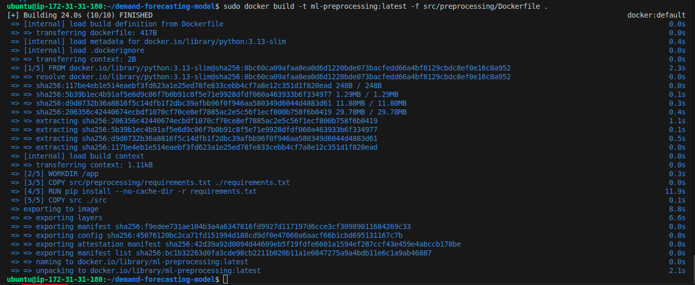
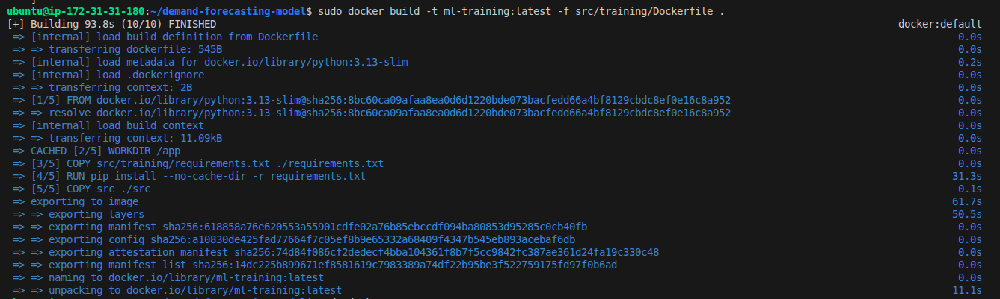
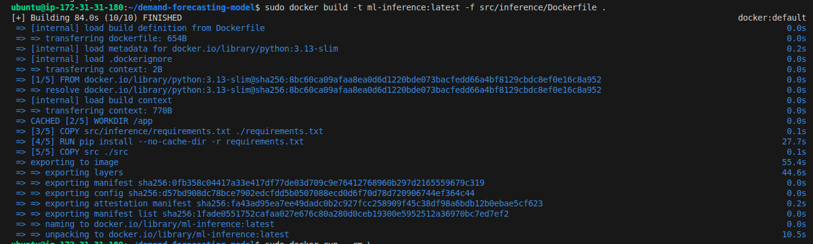

### Run
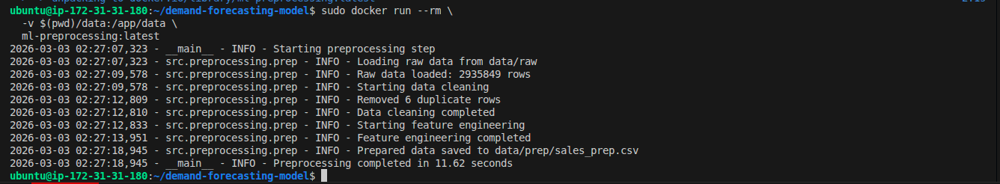
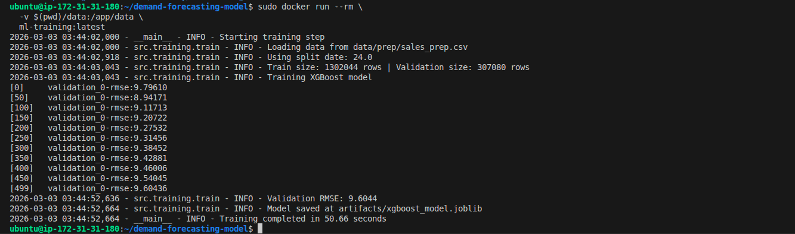
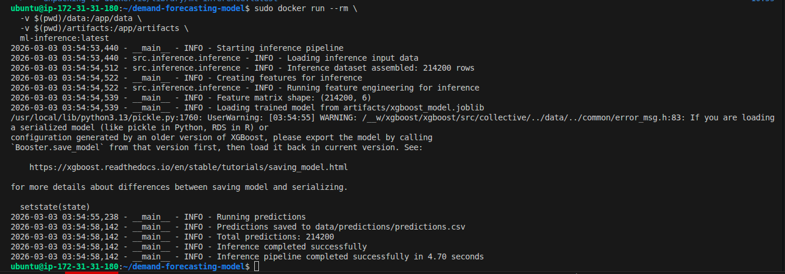

### Amazon ECR/Images
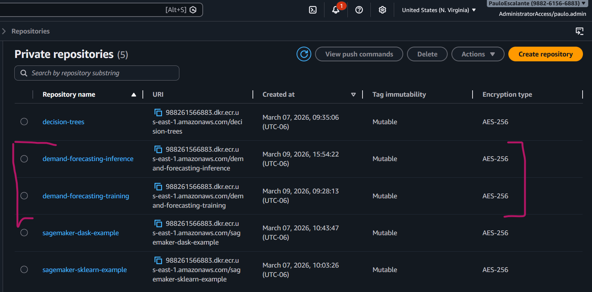
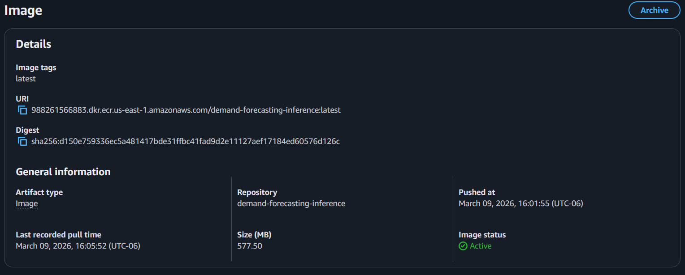
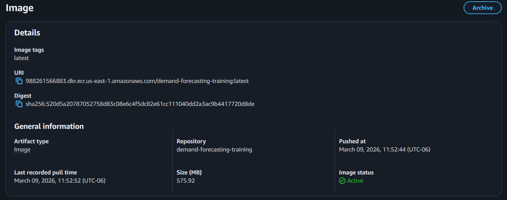

### Endpoint
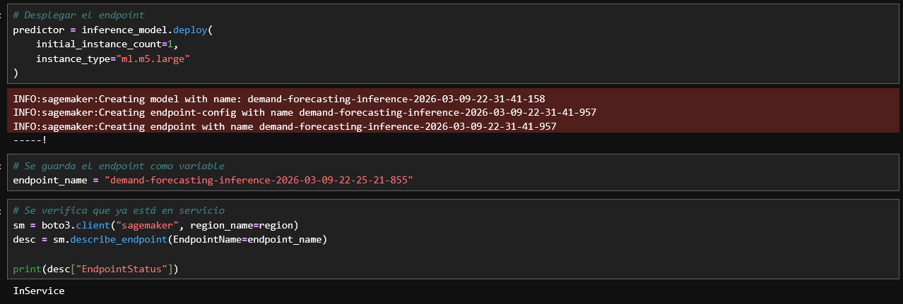
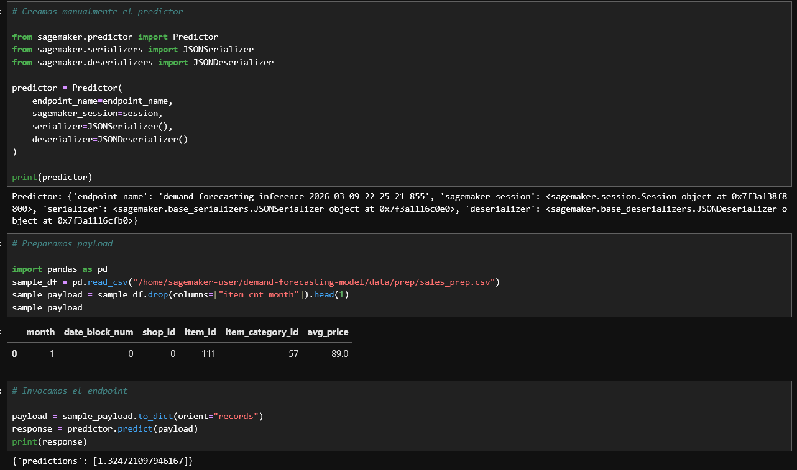

### Amazon ECR/Images - Preprocessing
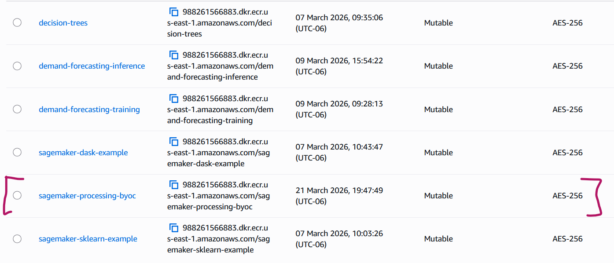
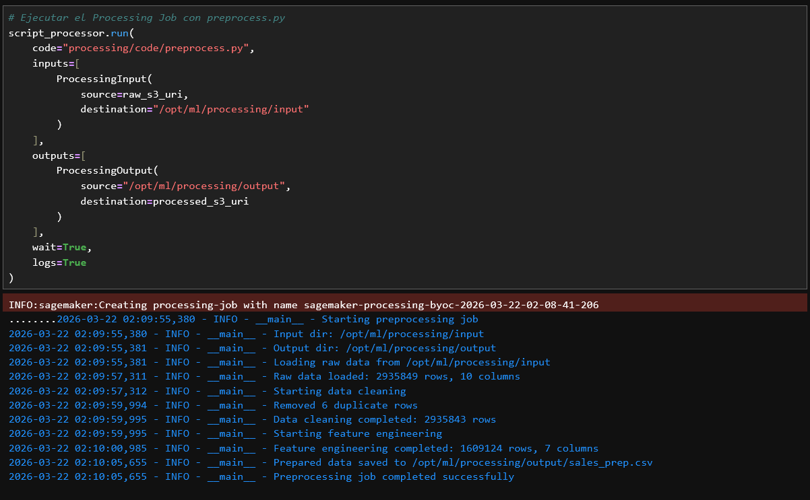
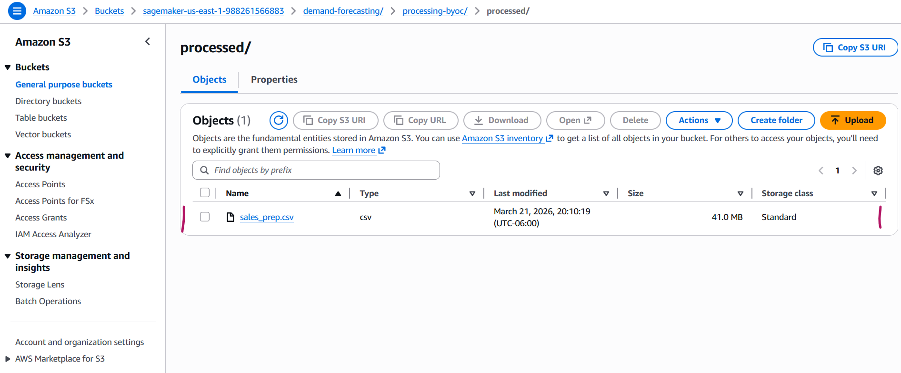

### Sagemaker Pipeline - BYOC (End-to-End)
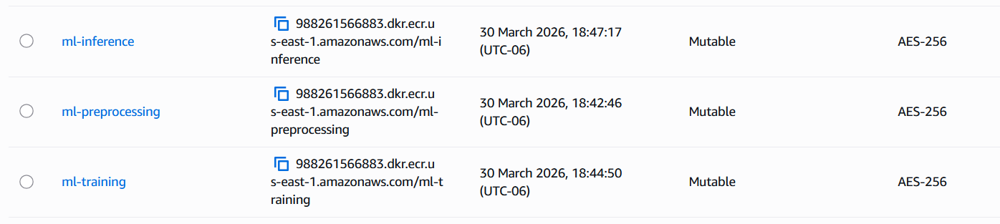
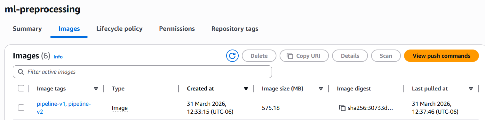
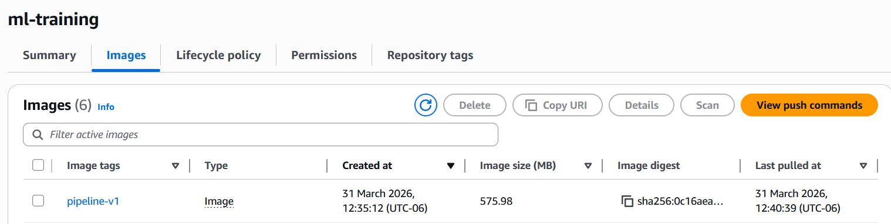
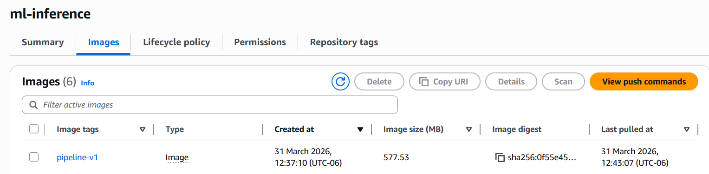
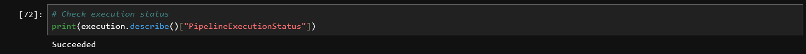
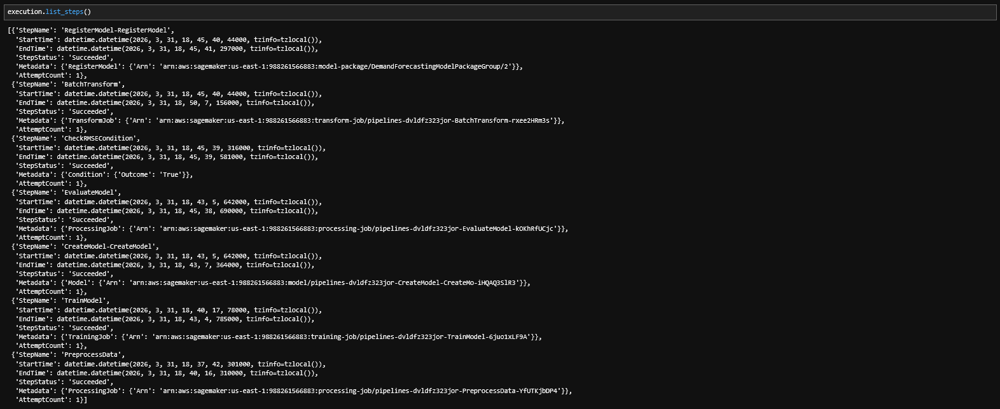
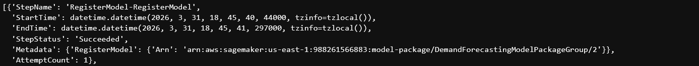
